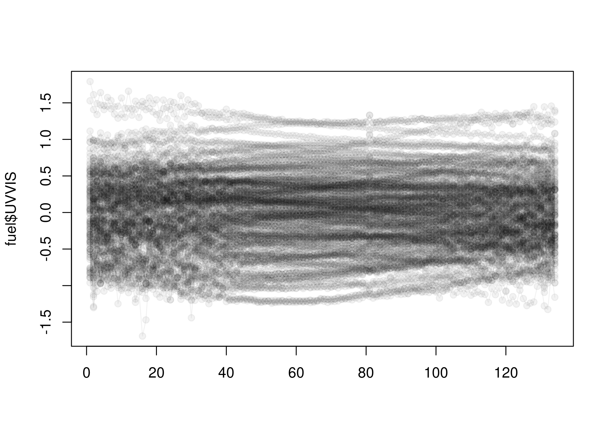

<!-- README.md is generated from README.Rmd. Please edit that file -->

# mlr3fda

<!-- badges: start -->

[](https://lifecycle.r-lib.org/articles/stages.html#experimental)
[](https://github.com/mlr-org/mlr3fda/actions/workflows/rcmdcheck.yaml)
[](https://CRAN.R-project.org/package=mlr3fda)
<!-- badges: end -->

The goal of mlr3fda is to extend `mlr3` to [functional
data](https://en.wikipedia.org/wiki/Functional_data_analysis). We use
the `tfd_irreg` datatype that is defined in the
[tf](https://github.com/fabian-s/tf) R package.

## Installation

You can install the development version of `mlr3fda` from
[GitHub](https://github.com/) with:

``` r
# install.packages("devtools")
devtools::install_github("mlr-org/mlr3fda")
```

## Example

After loading `mlr3fda` a new feature type is available.

``` r
library(mlr3)
mlr_reflections$task_feature_types
#>         lgl         int         dbl         chr         fct         ord 
#>   "logical"   "integer"   "numeric" "character"    "factor"   "ordered" 
#>         pxc 
#>   "POSIXct"

library(mlr3fda)
mlr_reflections$task_feature_types
#>         lgl         int         dbl         chr         fct         ord 
#>   "logical"   "integer"   "numeric" "character"    "factor"   "ordered" 
#>         pxc         fun 
#>   "POSIXct" "tfd_irreg"
```

For tutorials on how to create functional data, see the
[documentation](https://github.com/fabian-s/tf) of the `tf` package.

``` r
data("fuel", package = "mlr3fda")

plot(fuel$UVVIS)
```



Data with `tf_irreg` columns can be converted to a `Task` just like any
other dataset.

``` r
task = as_task_regr(fuel, target = "heatan")
task
#> <TaskRegr:fuel> (129 x 4)
#> * Target: heatan
#> * Properties: -
#> * Features (3):
#>   - fun (2): NIR, UVVIS
#>   - dbl (1): h20
```

Currently there are no `Learner`s that directly operate on functional
data. However one can extract simple functional features using the
`PipeOpFFS`.

``` r
library("mlr3fda")
library("mlr3verse")

po_fmean = po("ffs", feature = "mean", window = 5)

po_fmean$train(list(task))[[1L]]
#> <TaskRegr:fuel> (129 x 6)
#> * Target: heatan
#> * Properties: -
#> * Features (5):
#>   - dbl (3): NIR.fmean, UVVIS.fmean, h20
#>   - fun (2): NIR, UVVIS
```

This can be combined with a `Learner` into a complete `Graph`.

``` r
library(mlr3pipelines)

ids = partition(task)

# drop = TRUE means we remove the functional columns as features
graph = po("ffs", feature = "mean", window = 5, drop = TRUE) %>>%
  po("learner", learner = lrn("regr.rpart"))

glrn = as_learner(graph)

glrn$train(task, row_ids = ids$train)

glrn$predict(task, row_ids = ids$test)
#> <PredictionRegr> for 43 observations:
#>     row_ids   truth response
#>           1 26.7810 17.21959
#>           2 27.4720 17.21959
#>           3 23.8400 19.93467
#> ---                         
#>          14  7.0037 17.21959
#>          53 14.4000 17.21959
#>         126 11.8050 19.93467
```
